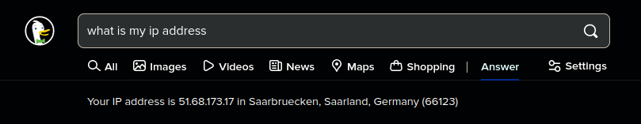

When hosting a server that should be accessible from the wider Internet, what people will need to connect is your external IP.

Some search engines (e.g. DuckDuckGo, Google) can show your external IP address if asked, with a query of "what is my ip address".



Alternatively `icanhazip.com` is a website that will simply respond with the external IP address you request it from. You can either open it in a web browser, or send a request in the terminal using `curl`:

```bash
>>> curl icanhazip.com
51.68.173.17
```
