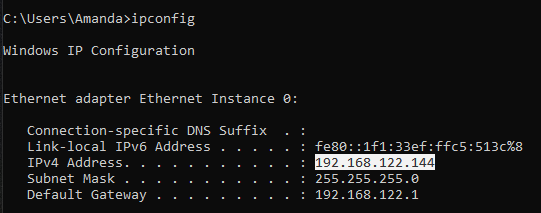
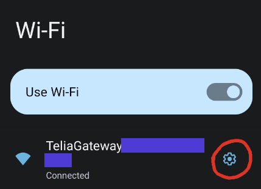
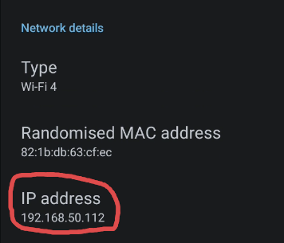

When connecting to a server over LAN, what you will need to find is the internal IP of the server.

## Windows
1. Open a command prompt: Press `Win + X`, type `cmd.exe` and press Enter.

2. Type `ipconfig`

3. Depending on your setup, you may have multiple network connections that show up. What you should focus on is an Ethernet or Wi-Fi connection, depending on how you have your computer connected to the router.

	Your internal IP will be the address listed as "IPv4 Address", and should begin with `192.168.X.X`.

	

## Linux
1. Open a terminal.

2. Type `ip addr`.

## Mac
TODO

## Android
The appearance of your settings app's interface can vary wildly depending on the

1. Open your Settings app and go into the Wi-Fi settings.

2. Find the currently connected Wi-Fi network, and press on the cogwheel icon.

	

3. Scroll down to the "Network details" section, you should see the IP address your device has.

	
