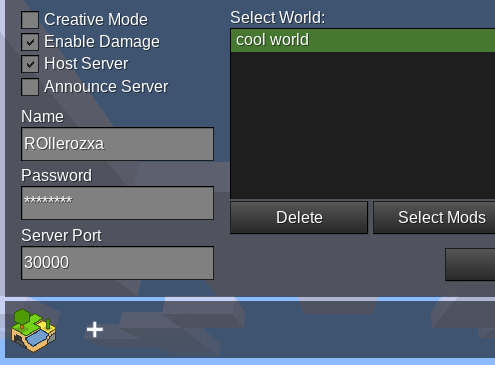
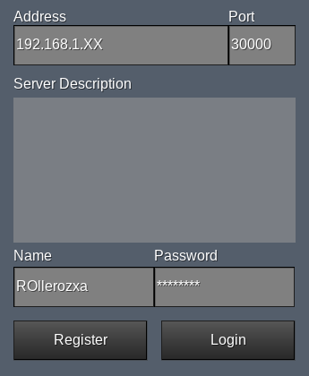

Playing with friends over LAN is very easily done by using the built-in "Host Server" option on the Start Game tab in the main menu.

When ticking the checkbox, some more options will appear. Input the username you as the server host would want to join as, and enter a password for that account. Unless you have a good reason to change it, you can leave the port at the default `30000`.

To have others on the LAN join your server, [find your internal IP address](obtain-internal-ip). This is what they will input as the address on the Join Game tab:

**Please note** that the server will be shut down once the server host player
